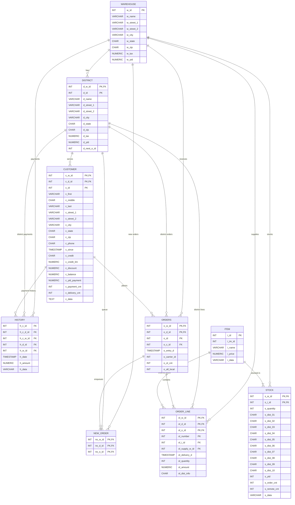

```mermaid
erDiagram
    WAREHOUSE {
        INT      w_id        PK
        VARCHAR  w_name
        VARCHAR  w_street_1
        VARCHAR  w_street_2
        VARCHAR  w_city
        CHAR     w_state
        CHAR     w_zip
        NUMERIC  w_tax
        NUMERIC  w_ytd
    }

    DISTRICT {
        INT      d_w_id      PK, FK
        INT      d_id        PK
        VARCHAR  d_name
        VARCHAR  d_street_1
        VARCHAR  d_street_2
        VARCHAR  d_city
        CHAR     d_state
        CHAR     d_zip
        NUMERIC  d_tax
        NUMERIC  d_ytd
        INT      d_next_o_id
    }

    CUSTOMER {
        INT      c_w_id          PK, FK
        INT      c_d_id          PK, FK
        INT      c_id            PK
        VARCHAR  c_first
        CHAR     c_middle
        VARCHAR  c_last
        VARCHAR  c_street_1
        VARCHAR  c_street_2
        VARCHAR  c_city
        CHAR     c_state
        CHAR     c_zip
        CHAR     c_phone
        TIMESTAMP c_since
        CHAR     c_credit
        NUMERIC  c_credit_lim
        NUMERIC  c_discount
        NUMERIC  c_balance
        NUMERIC  c_ytd_payment
        INT      c_payment_cnt
        INT      c_delivery_cnt
        TEXT     c_data
    }

    HISTORY {
        INT      h_c_id      FK
        INT      h_c_d_id    FK
        INT      h_c_w_id    FK
        INT      h_d_id      FK
        INT      h_w_id      FK
        TIMESTAMP h_date
        NUMERIC   h_amount
        VARCHAR   h_data
    }

    ORDERS {
        INT      o_w_id      PK, FK
        INT      o_d_id      PK, FK
        INT      o_id        PK
        INT      o_c_id      FK
        TIMESTAMP o_entry_d
        INT      o_carrier_id
        INT      o_ol_cnt
        INT      o_all_local
    }

    NEW_ORDER {
        INT      no_w_id     PK, FK
        INT      no_d_id     PK, FK
        INT      no_o_id     PK, FK
    }

    ORDER_LINE {
        INT      ol_w_id        PK, FK
        INT      ol_d_id        PK, FK
        INT      ol_o_id        PK, FK
        INT      ol_number      PK
        INT      ol_i_id        FK
        INT      ol_supply_w_id FK
        TIMESTAMP ol_delivery_d
        INT      ol_quantity
        NUMERIC  ol_amount
        CHAR     ol_dist_info
    }

    ITEM {
        INT      i_id       PK
        INT      i_im_id
        VARCHAR  i_name
        NUMERIC  i_price
        VARCHAR  i_data
    }

    STOCK {
        INT      s_w_id       PK, FK
        INT      s_i_id       PK, FK
        INT      s_quantity
        CHAR     s_dist_01
        CHAR     s_dist_02
        CHAR     s_dist_03
        CHAR     s_dist_04
        CHAR     s_dist_05
        CHAR     s_dist_06
        CHAR     s_dist_07
        CHAR     s_dist_08
        CHAR     s_dist_09
        CHAR     s_dist_10
        INT      s_ytd
        INT      s_order_cnt
        INT      s_remote_cnt
        VARCHAR  s_data
    }

    %% ----------------------------------------------------------
    %%  Relationships
    %% ----------------------------------------------------------
    WAREHOUSE ||--o{ DISTRICT   : has
    WAREHOUSE ||--o{ STOCK      : stocks
    WAREHOUSE ||--o{ ORDERS     : receives
    WAREHOUSE ||--o{ NEW_ORDER  : "new orders"
    WAREHOUSE ||--o{ ORDER_LINE : supplies
    WAREHOUSE ||--o{ HISTORY    : payments

    DISTRICT  ||--o{ CUSTOMER   : serves
    DISTRICT  ||--o{ ORDERS     : "district orders"
    DISTRICT  ||--o{ NEW_ORDER  : queue
    DISTRICT  ||--o{ ORDER_LINE : "district lines"
    DISTRICT  ||--o{ HISTORY    : "district payments"

    CUSTOMER  ||--o{ ORDERS     : places
    CUSTOMER  ||--o{ HISTORY    : "payment history"

    ORDERS    ||--|{ ORDER_LINE : contains
    ORDERS    ||--o{ NEW_ORDER  : enqueues

    ITEM      ||--|{ STOCK      : "stocked in"
    ITEM      ||--o{ ORDER_LINE : "ordered items"
```